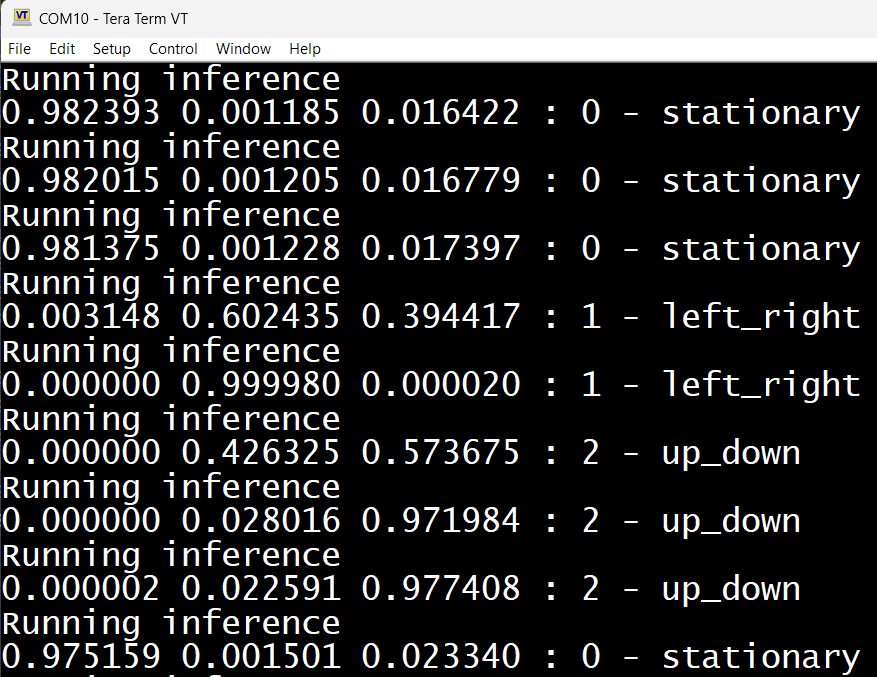

# U5-MEMS-Human-Activity-Recognition

Real-time Human Activity Recognition (HAR) implementation using onboard MEMS motion sensors.

## Hardware Stack
- **Development Board**: STM32 B-U585I-IOT02A Discovery kit
- **Sensors**: 
  - **ISM330DHCX**: 6-axis accelerometer & gyroscope (configured for DRDY Interrupts at 52Hz ODR, 4g FS for Accelerometer and 1000dps FS for Gyroscope)
  - **LPS22HH, IIS2MDC, HTS221**: Additional environmental/motion sensors (initialized in polling mode)

## Software Requirements
This project was built and tested with the following software stack:
- **STM32CubeIDE**: [v2.2.0](https://www.st.com/en/development-tools/stm32cubeide)
- **STM32CubeMX**: [v6.17.0](https://www.st.com/en/development-tools/stm32cubemx.html)
- **X-CUBE-AI**: [v10.2.0](https://www.st.com/en/embedded-software/x-cube-ai.html)
- **X-CUBE-MEMS1**: [v12.0.0](https://www.st.com/en/embedded-software/x-cube-mems1.html)
- **STM32Cube MCU Package for STM32U5 series**: [v1.8.0](https://www.st.com/en/embedded-software/stm32cubeu5.html)

## Dependencies
The custom datalogging and model training pipeline in the [Tools/](https://github.com/Aditya08p/HAR-Utilities) submodule requires Python 3.11 and the following packages (see [Tools/requirements.txt](https://github.com/Aditya08p/HAR-Utilities/blob/main/requirements.txt)):
- `numpy==1.23.5`
- `tensorflow==2.12.0`
- `matplotlib==3.7.2`
- `seaborn==0.12.2`
- `scikit-learn==1.2.2`
- `pyserial`

It is recommended to use a python virtual environment to ensure compatibility with the required package versions.

Initialize a virtual environment:
```bash
python -m venv venv
```

Activate the virtual environment:
```bash
# On Windows:
venv\Scripts\activate

# On macOS/Linux:
source venv/bin/activate
```

Install them using:
```bash
pip install -r Tools/requirements.txt
```

## Project Structure
- [U5_MEMS_HAR/](U5_MEMS_HAR/): STM32CubeMX generated project containing the firmware, sensor drivers, and X-CUBE-AI middleware.
- [Tools/](https://github.com/Aditya08p/HAR-Utilities): Submodule containing Python scripts for data collection ([Scripts/har_logger.py](https://github.com/Aditya08p/HAR-Utilities/blob/main/Scripts/har_logger.py)), dataset management, and model training ([Scripts/har_train.py](https://github.com/Aditya08p/HAR-Utilities/blob/main/Scripts/har_train.py)).
- [Binary/](U5_MEMS_HAR/Binary/): Pre-compiled binaries for both datalogging and inference modes.

## Features
- **Custom Datalogging & Training Pipeline**: Read sensor data via the ST-LINK serial port, visualize it, and train a custom TensorFlow Sequential model.
- **X-CUBE-AI Integration**: The trained TensorFlow model (`.h5`) is optimized and integrated into the STM32 project using the X-CUBE-AI expansion package.
- **Runtime Mode Switching**: Seamlessly toggle between datalogging and AI inference modes without needing to flash different firmware.

## Data Format
The datalogging scripts save the sensor data in CSV files. Each row contains a timestamp followed by 6-axis IMU data (accelerometer and gyroscope).
**Format:**
`timestamp, acc_x, acc_y, acc_z, gyro_x, gyro_y, gyro_z`

## How to Use

### 1. Hardware Setup
Connect your STM32 B-U585I-IOT02A board to your PC via the ST-LINK USB port. Flash the combined firmware from the `U5_MEMS_HAR` project using STM32CubeIDE or simply use the pre-compiled binaries in the `Binary/` folder.

### 2. Datalogging Mode
By default, the board is in Datalogging mode where it streams raw ISM330DHCX sensor data over the serial port.
- Open a terminal and run the logger script to record data for different activities (e.g., stationary, left_right, up_down):
  ```bash
  python Tools/Scripts/har_logger.py --port COM_PORT --duration 60 --output Tools/Scripts/stationary.csv
  ```

### 3. Model Training
Once you've collected the CSV dataset files, you can train the HAR model:
- Run the training script pointing to your dataset directory:
  ```bash
  python Tools/Scripts/har_train.py --data-dir Tools/Scripts
  ```
- This will output a trained `model.h5` file along with accuracy metrics and a confusion matrix.
- Import this `.h5` model into STM32CubeMX via X-CUBE-AI to generate the optimized C code for the microcontroller, and recompile the project.

### 4. AI Inference Mode
Press the **User Button** on the board to toggle the `inference_enable` flag. 
- The board will switch from streaming raw data to streaming the AI model's real-time inference predictions over the serial port.
- Monitor the output using any standard serial monitor at 115200 baud, Tera Term output is shown below as an example.

**Inference Output:**


